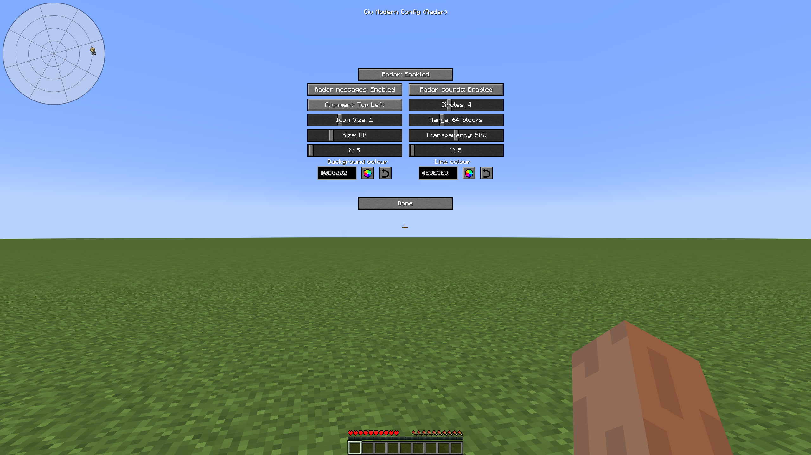

# CivModern

## Features

CivModern features radar, a macro to hold left (bound to `-`) or right click (bound to `=`), a macro for auto attacking (bound to `0`), and a macro for travelling down ice roads (bound to backspace).
It highlights compacted items, making them easier to spot at a glance.
These features can be configured in game by pressing R.
The controls can also be modified in your controls screen.

## Installation instructions

CivModern supports both the Forge and Fabric modloaders on 1.18.2
Download the version for your modloader at [Releases](https://github.com/okx-code/civmodern/releases/latest).

The Fabric version requires Fabric API.

The mod's configuration file can be found at `MINECRAFT/config/civmodern.properties` where `MINECRAFT` is your Minecraft instance's installation directory.
